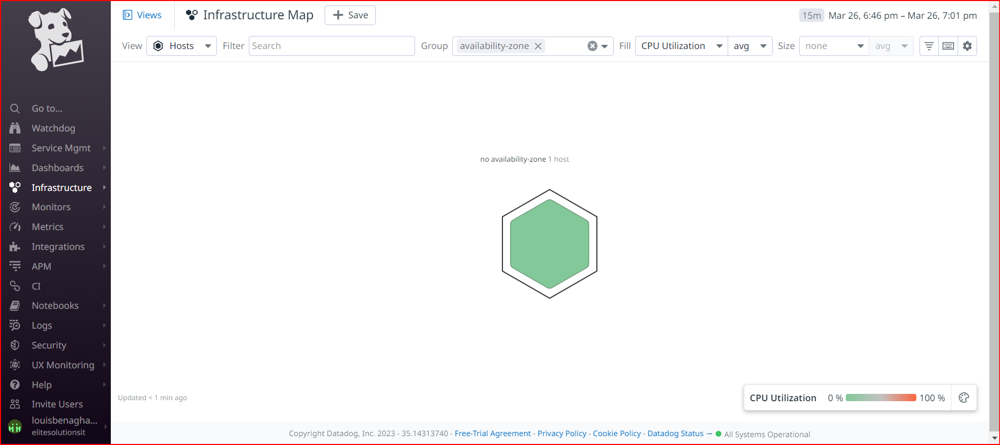
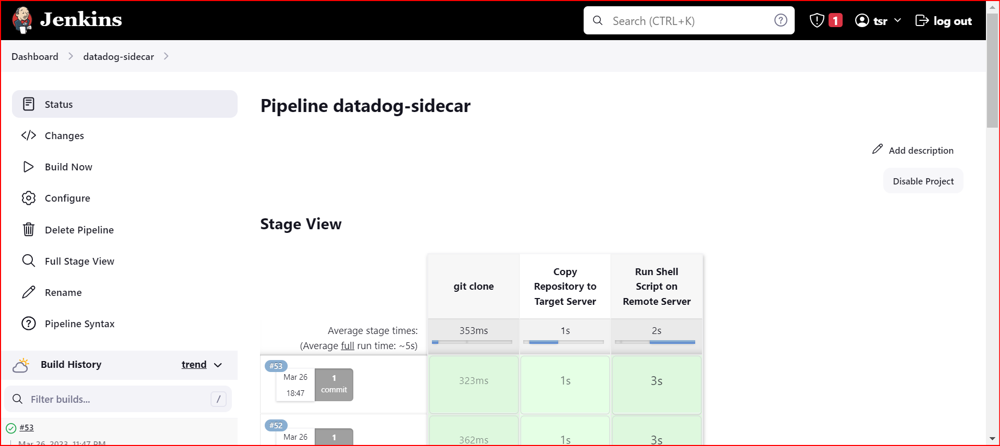
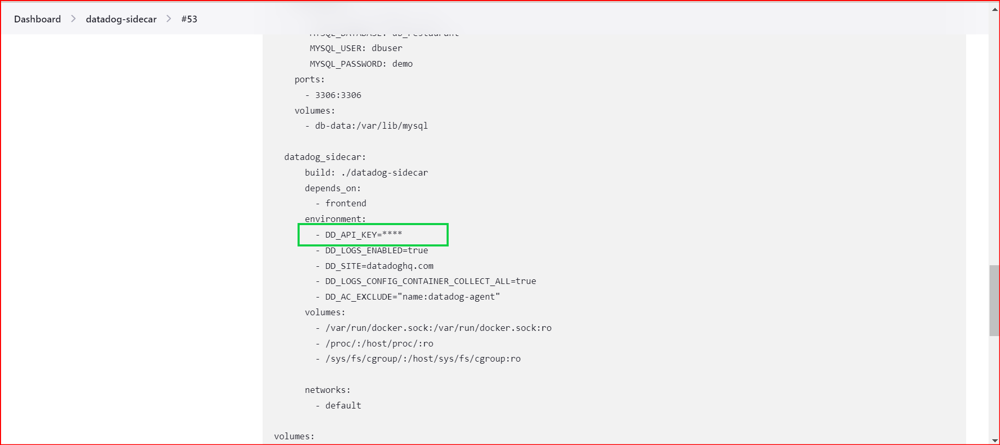

# Datadog sidecar container to monitor backend and frontend.

Once set is sucessfully completed you should see host on your dashboard


Note: Don't push your API key to github. Redact it before push.


# Jenkins CICD Implementation

```
post {
        always {
            cleanWs()
        }
    }
```

The post block in the Jenkinsfile defines actions that should be executed after the pipeline completes, regardless of whether it succeeded or failed. The always directive inside the post block ensures that the actions inside it will run in all cases, no matter the result of the pipeline.

The `cleanWs()` function is a built-in Jenkins Pipeline function that cleans the workspace by deleting all files and directories in it. The purpose of calling `cleanWs()` in the post block is to clean up the workspace after the pipeline has finished running, ensuring that any temporary files, logs, or artifacts generated during the pipeline execution are removed. This helps to keep the Jenkins workspace clean and avoids consuming unnecessary disk space.

In summary, the post block with always `{ cleanWs() }` ensures that the workspace is cleaned up after the pipeline has completed, regardless of whether it succeeded or failed.


Deploy stage, of course is the crucial stage, and there are different ways do it, here is how i excute mine.

```
stage('Deploy to Target Server') {
    steps {
        withCredentials([
            usernamePassword(credentialsId: 'dockerhub-credentials', usernameVariable: 'DOCKER_USERNAME', passwordVariable: 'DOCKER_TOKEN'),
            sshUserPrivateKey(credentialsId: 'server-ssh-key', keyFileVariable: 'SSH_KEY_FILE', usernameVariable: 'SERVER_USERNAME')
        ]) {
            sh """
                export DOCKER_USERNAME=${DOCKER_USERNAME}
                export DOCKER_TOKEN=${DOCKER_TOKEN}
                export SERVER_USERNAME=${SERVER_USERNAME}
                export SERVER_HOST='your-server-host'
                chmod +x deploy-to-target.sh
                ssh-agent bash -c 'ssh-add ${SSH_KEY_FILE}; ./deploy-to-target.sh'
            """
        }
    }
}
```
`withCredentials` is used to inject the Docker Hub credentials and the server `SSH` key into the script environment. The `usernamePassword` function is used to set the `DOCKER_USERNAME` and `DOCKER_TOKEN` variables, while the `sshUserPrivateKey` function is used to set the `SERVER_USERNAME` and `SSH_KEY_FILE` variables.

After setting the environment variables, the script runs ssh-agent with the `SSH_KEY_FILE` added, and then executes the `deploy-to-target.sh` script.

Don't forget to replace 'your-server-host' with the IP address or domain name of your target Ubuntu server. Additionally, ensure the credential IDs in the `withCredentials` block match the ones you have configured in Jenkins.

Jenkins permissions, make sure to ad jenkins user with ALL permersion like:
```
jenkins ALL=(ALL) NOPASSWD:ALL
```

Inject Secrets, i handled that with terraform on the infrastructure side.
In your null_resource with `local-exec` provisioner, upload the rendered configuration files to the target server and continue with the deployment process.
In both cases, you'll need to create template files for datadog.yaml and docker-compose.yaml with placeholders for the API key, like `${DATADOG_API_KEY}`. The actual configuration files will be generated with the secrets injected during the deployment process, ensuring that the API keys are never stored in the repository.

As show below the datadog api key get redacted while jenkins runs the playbook.




Detailed pipeline image shown below:

