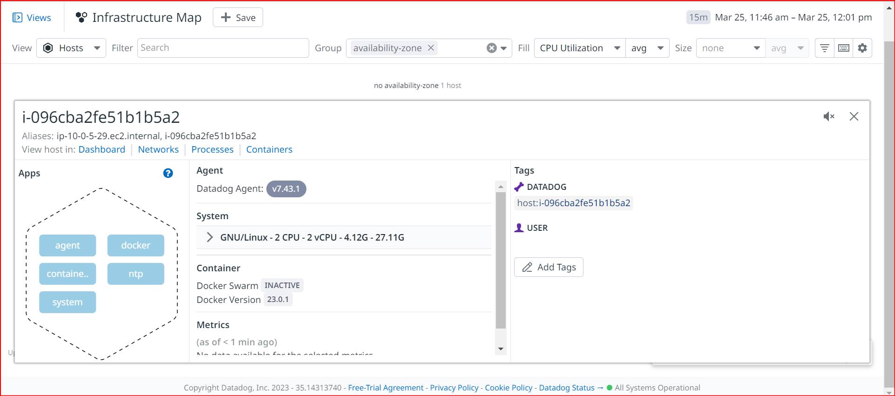
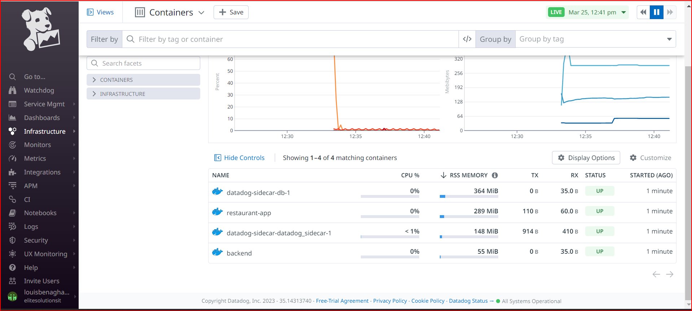
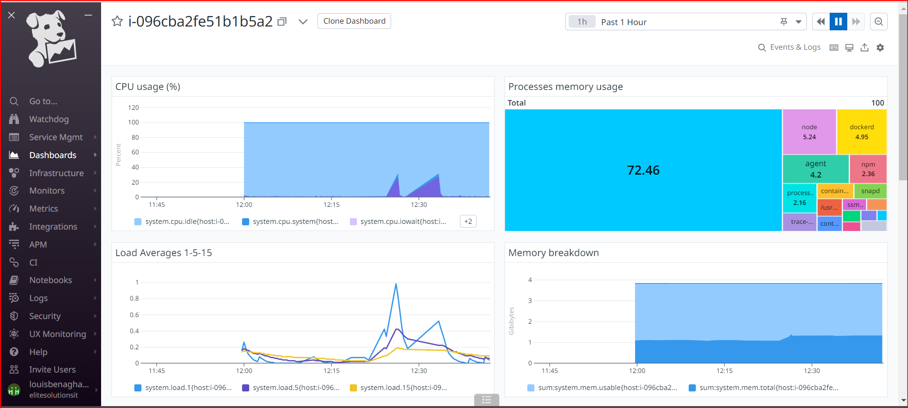

# Datadog sidecar container to monitor backend and frontend.

Once set is sucessfully completed you should see host on your dashboard

Note: Don't push your API key to github. Redact it before push.